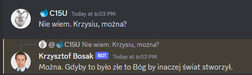

## [Discordx readme](README_DISCORDX.md)
# Krzysztof Bosak Discord bot
Bardzo prosty bot discordowy odpowiadający na najważniejsze pytanie.


# Konfiguracja
Wkleić token do pliku `.env` w formacie:
```
BOT_TOKEN=<TOKEN>
```
